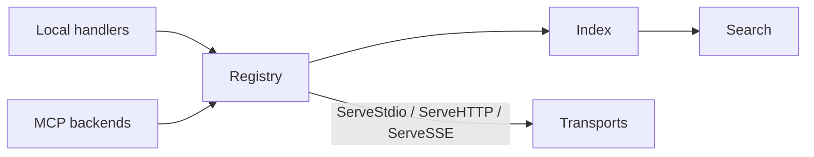

# registry

High-level helpers for building MCP servers with tool discovery, registration,
local execution, and MCP backend aggregation. The registry composes:

- `toolfoundation/model` (tool schema + validation)
- `tooldiscovery/index` (registry + lookup)
- `tooldiscovery/search` (BM25 search)

## Goals

- Provide a fast path to a working MCP server.
- Keep tool discovery and tool execution in a single, minimal API.
- Support local tools and federated MCP backends.

## Package Overview

```text
registry/
├── registry.go   # Core Registry type and lifecycle
├── handler.go    # Local tool handler and registration helpers
├── backend.go    # MCP backend connections
├── mcp.go        # MCP JSON-RPC request/response handling
├── server.go     # ServeStdio, ServeHTTP, ServeSSE
└── errors.go     # Sentinel errors + MCP error codes
```

## Core Types

```go
// Config configures a Registry.
type Config struct {
    SearchConfig    *search.BM25Config
    ServerInfo      ServerInfo
    BackendSelector index.BackendSelector
}

// ServerInfo describes this MCP server for initialize response.
type ServerInfo struct {
    Name    string
    Version string
}

// Registry is a high-level MCP tool registry.
type Registry struct { /* ... */ }
```

## Local Tools

```go
reg := registry.New(registry.Config{
    ServerInfo: registry.ServerInfo{
        Name:    "my-mcp",
        Version: "1.0.0",
    },
})

reg.RegisterLocalFunc(
    "echo",
    "Echoes back input",
    map[string]any{
        "type": "object",
        "properties": map[string]any{
            "message": map[string]any{"type": "string"},
        },
        "required": []string{"message"},
    },
    func(ctx context.Context, args map[string]any) (any, error) {
        return map[string]any{"echo": args["message"]}, nil
    },
    registry.WithNamespace("utility"),
    registry.WithTags("echo", "debug"),
)
```

## MCP Backends

Backends allow the registry to aggregate tools from other MCP servers.

```go
err := reg.RegisterMCP(registry.BackendConfig{
    Name: "remote-tools",
    URL:  "https://example.com/mcp",
    Headers: map[string]string{
        "Authorization": "Bearer ...",
    },
})
```

### BackendConfig

```go
type BackendConfig struct {
    Name          string
    URL           string
    Headers       map[string]string
    MaxRetries    int
    RetryInterval time.Duration
    Transport     mcp.Transport // optional override
}
```

- `URL` supports `http(s)://` (streamable HTTP), `sse://` (legacy SSE), and
  `stdio://` (stdio transport bound to the current process).
- `Headers` are injected into HTTP requests.
- `Transport` is useful for tests or custom transports (e.g. in-memory).

## Execution

```go
result, err := reg.Execute(ctx, "utility:echo", map[string]any{"message": "hi"})
```

Execution routing:

1. Tool lookup in `index`
2. Backend selection via `BackendSelector`
3. Local handler or MCP backend call

### Result Mapping

When calling an MCP backend:

- `StructuredContent` is returned when available
- single `TextContent` returns a string
- otherwise, the full `[]mcp.Content` is returned

## MCP Protocol Handling

The registry handles MCP JSON-RPC methods:

- `initialize`
- `tools/list`
- `tools/call`

These are exposed via `ServeStdio`, `ServeHTTP`, or `ServeSSE`.

## Transports

```go
// Stdio
_ = registry.ServeStdio(ctx, reg)

// HTTP (streamable)
http.Handle("/mcp", registry.ServeHTTP(reg))

// SSE (legacy)
http.Handle("/mcp-sse", registry.ServeSSE(reg))
```

## Lifecycle

```go
if err := reg.Start(ctx); err != nil {
    log.Fatal(err)
}
defer reg.Stop()
```

- `Start` connects registered MCP backends and registers their tools
- `Stop` closes backend sessions

## Errors

Registry returns sentinel errors from `errors.go`:

- `ErrNotStarted`
- `ErrAlreadyStarted`
- `ErrToolNotFound`
- `ErrBackendNotFound`
- `ErrHandlerNotFound`
- `ErrExecutionFailed`
- `ErrInvalidRequest`

## Diagram


